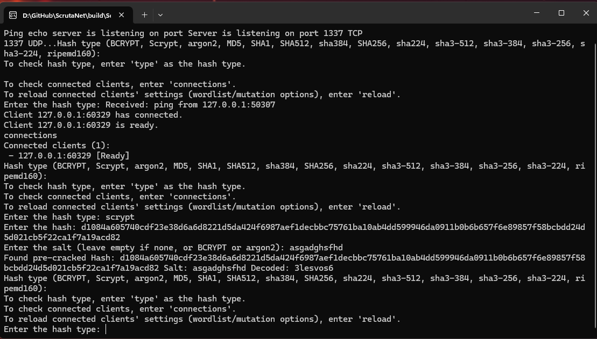
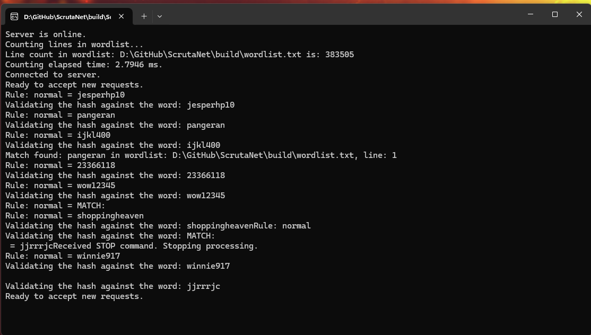

<h3 align="center">
	<a href="https://github.com/WingsOfAltair/Distributed-Hash-Cracker-CPP-GUI">Distributed Hash Cracker CPP GUI/CLI</a>
</h3>

	
	
	

	

## Previews

 Server GUI

 

 Server CLI

 

 Client CLI

 

## Usage

1. Clone this repository locally
2. Read compilation steps file based on your OS
3. Configure client's config.ini, mutation_list.txt (you can generate one using python script in resources folder), and a good wordlist
4. Run by either double-clicking built executable files on Windows and Linux, or by dragging executable(s) on Linux to a Terminal

##  Dependencies

1. CMake (minimum 3.30.4)
2. Boost (lib64-msvc-14.3)
3. OpenSSL (3.3.2)
4. Libsodium
5. Qt6 (6.9.1)

## 💝 Thanks to

- Original Author & Maintainer [WingsOfAltair](https://github.com/WingsOfAltair)

&nbsp;

	

	Copyright &copy; 2025 - Present <a href="https://wingsofaltair.github.io/Plancksoft/" target="_blank">Plancksoft</a>

	

