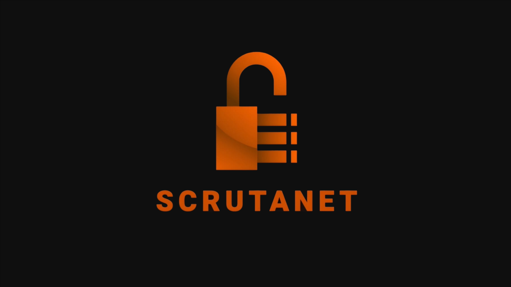
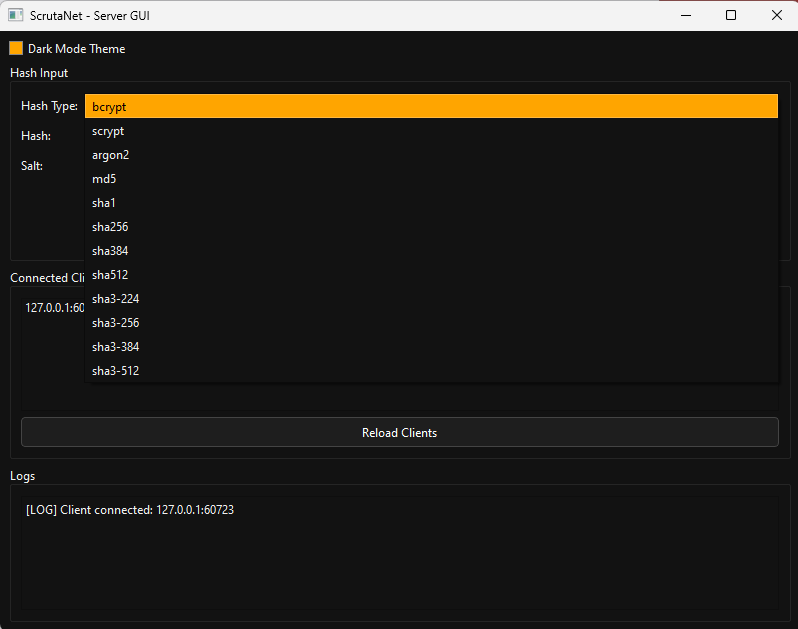
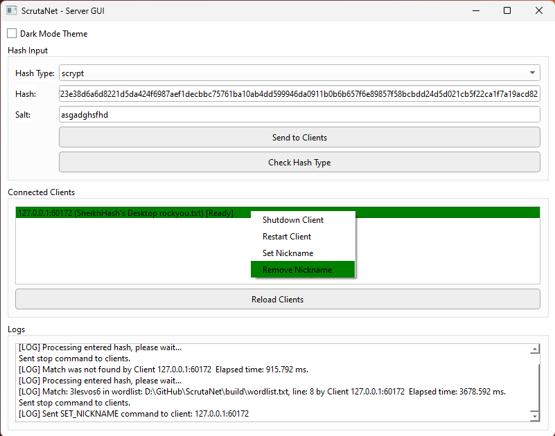

<h3 align="center">
	 
	<a href="https://github.com/WingsOfAltair/ScrutaNet">ScrutaNet</a>
</h3>

	
	
	

	

## About

This repository contains the source code to three projects:

1. ScrutaNet Server GUI

A centralized real-time command center which manages several hash cracking clients. It is built using Qt6 C++ with an intuitive graphical user interface; supporting both Light & Dark mode.

It features more features than the CLI version through its user interface.

Clients can be given nicknames to differentiate between them using the server GUI context menu.

Clients can be restarted, shutdown, reloaded, and stopped using this version (GUI).

2. ScrutaNet Server CLI

A centralized command center with limited features. It is meant as a lightweight command center with a command line interface.

3. ScrutaNet Client CLI

The actual hash cracking client which connects to the server and receives coordination requests from it. Multiple clients connect to the same server to attack one hash.

The client can be configured to be multi-threaded or single-threaded. Also, it supports chained word mutations through specific mutation options which can be setup in the mutation_list.txt file.

## Previews

 Server GUI

 
 

 Server CLI

 

 Client CLI

 

## Usage

1. Clone this repository locally
2. Read compilation steps file based on your OS
3. Configure client's config.ini, mutation_list.txt (you can generate one using python script in resources folder), and a good wordlist
4. Run by either double-clicking built executable files on Windows and Linux, or by dragging executable(s) on Linux to a Terminal

##  Dependencies

1. CMake (minimum 3.30.4)
2. Boost (lib64-msvc-14.3)
3. OpenSSL (3.3.2)
4. Libsodium
5. Qt6 (6.9.1)

## 💝 Thanks to

- Original Author & Maintainer [WingsOfAltair](https://github.com/WingsOfAltair)

&nbsp;

	

	Copyright &copy; 2025 - Present <a href="https://wingsofaltair.github.io/Plancksoft/" target="_blank">Plancksoft</a>

	

